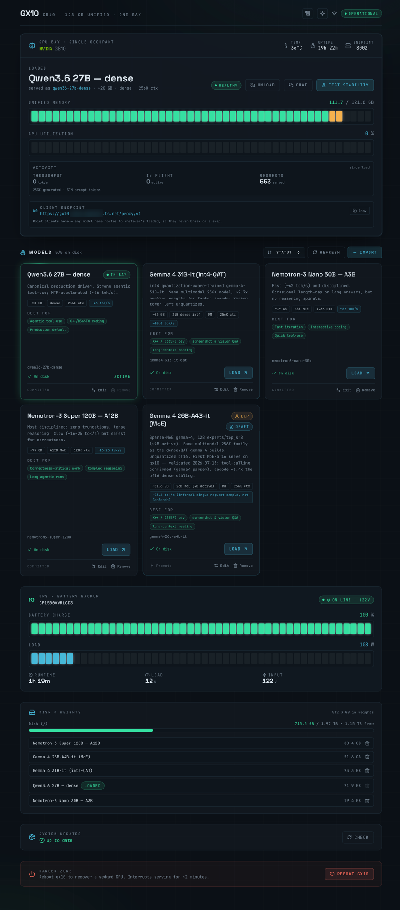

# DGX Spark Dashboard / Model Bay

A small web control plane for an NVIDIA **DGX Spark (GB10)** doing one-model-at-a-time vLLM
serving. The GB10 has no MIG (Multi-Instance GPU) support — NVIDIA says that's architectural, not
a driver gap, a consequence of its unified CPU/GPU memory pool — so there's no hardware-isolated
way to run multiple models concurrently with guaranteed, separated resources. Combined with the
large memory footprints of the models this tool targets and the fact that `nvidia-smi -r` refuses
to reset the box's sole/primary GPU (so a bad interaction between co-resident workloads could wedge
the whole box, recoverable only by reboot), this tool deliberately serves **one model at a time**
rather than trying to co-schedule several. This tool exists to make swapping between models a safe,
one-click, drain-aware operation instead of a footgun.

Click a model in the dashboard and it checks what's currently loaded, and if the target differs:
stops the running container, **drains the GPU**, starts the target with its validated per-model
recipe, and waits for health. Every model serves on the same port, so clients never change their
endpoint.

## Screenshots



## Features

- **One-click model swap** — stop → drain the GPU → serve the target → wait for health, so
  switching models never risks wedging the box (see the GPU-reset note above).
- **Live telemetry** — unified memory usage, GPU utilization, temperature, uptime, decode
  throughput, and in-flight/served request counts.
- **Model registry** — every recipe as a card with size, quant, context, measured speed, and
  "best for" tags; committed (official) vs. draft (unpromoted) status at a glance.
- **Import from Hugging Face** — paste a repo id, get an auto-proposed recipe from its
  `config.json`, edit anything, and optionally kick off the weights download in one step. Full
  walkthrough below.
- **Hand-edit recipes** — edit a model's raw `.env` directly for tuning knobs the Import form
  doesn't expose (tool-parser choice, KV cache dtype, sampling overrides, hand-written comments).
- **HF lookup** — re-fetch a model's own `config.json` from Hugging Face while editing, so you're
  never trusting a stale or misremembered spec.
- **GB10 stability battery** — a 9-test suite (health, generation, coherence, long-form,
  streaming, tool-calling, large-context, concurrency, sustained run) that validates a model
  actually serves reliably on this hardware before you rely on it. A clean pass clears the
  **Experimental** flag.
- **Promote workflow** — once a model's proven stable, commit + push its recipe straight to the
  model-configs repo from the dashboard — no separate git round-trip.
- **Transparent model proxy** (`/proxy/v1`) — an OpenAI-compatible endpoint that always routes to
  whatever's currently loaded, so client configs never break on a swap.
- **Chat panel** — talk to the loaded model directly from the dashboard, served by a sandboxed
  companion daemon so untrusted model output never touches the privileged control plane.
- **Disk & weights management** — see per-model disk usage, delete a model's weights, or clean up
  leftover bytes from aborted downloads.
- **System updates** — check and install `apt` upgrades from the dashboard, password-gated per
  action (no standing passwordless grant).
- **UPS telemetry** — battery charge, load, and runtime if a supported UPS is attached.
- **Log viewer** — tail the loaded model's container logs or the swap-ui service journal without
  SSHing in.
- **Reboot control** — a confirm-gated way to recover a wedged GPU.

## Importing a model from Hugging Face

1. Click **Import** (top-right of the Models section) — or use the deep link
   `/?import=<owner>/<repo>` to open the dialog pre-filled and auto-inspected.
2. Paste the HF repo id (e.g. `owner/Model-Name-NVFP4`) into **HF repo id** and click **Inspect**.
3. The backend fetches the repo's `config.json` and proposes a recipe:
   - reasoning parser guessed from the architecture/name (`qwen3`, `nemotron_v3`, or none)
   - context length from `max_position_embeddings` (capped at 262144 to bound KV memory)
   - quantization detected from `quantization_config` (NVFP4/ModelOpt, fp8, AWQ, or `auto`)
   - tool-calling on, spec-decode off, flagged **Experimental**

   Anything the detection couldn't determine (missing config, unrecognized architecture, no quant
   info) shows up as an inline warning — read those before trusting the defaults.
4. Edit anything that needs correcting: model id, display label, reasoning parser, quantization,
   max context, or extra vLLM args (e.g. `--max-num-seqs 4` for MoE models).
5. Click **Add & download** to save the recipe as a draft and start pulling weights into the
   HF-cache volume in the background — or **Add only** to just save the recipe (weights then pull
   automatically on first load).
6. Once weights are down, **Load** it from the Models grid.
7. Run **Test stability** on the loaded model — a clean pass on the GB10 battery clears the
   Experimental flag.
8. Once non-experimental, **Promote** commits and pushes the recipe to `gb10-model-configs` —
   no separate git step needed.

New recipes always start as **drafts**, and their tuning knobs (spec-decode, KV cache dtype,
sampling overrides) are pinned off — validated per-model tuning like the canonical Qwen3.6 recipe
isn't something the importer can infer from `config.json` alone.

**Gated or rate-limited repos**: set `HF_TOKEN` (see `swap-ui/README.md`'s "Model lifecycle"
section). Without it, public repos still download but at an unauthenticated rate limit, and gated
repos fail outright.

## Layout

```
├── swap-ui/          FastAPI backend + React/Vite dashboard — the web control plane
├── agent/            Unprivileged companion daemon that owns the chat/agent tool-execution path
├── orchestration/     Bash drivers (stop → drain → serve) — single source of truth for vLLM flags
├── manifests/         Pinned container images + shared stack config
└── systemd/           Unit files for both services
```

Model **recipes** (which checkpoint, quant, context length, sampling profile, per-model vLLM
flags) live in a separate, dedicated repo —
[`007applejacks/gb10-model-configs`](https://github.com/007applejacks/gb10-model-configs) — so the
tool and the model registry can version independently. See that repo's README for the recipe
format.

## Quick start

```bash
cd swap-ui/frontend && npm ci && npm run build      # → frontend/dist/, served by app.py
cd ../.. && swap-ui/bootstrap.sh                     # create the backend venv
CONFIGS_REPO=/path/to/gb10-model-configs \
  swap-ui/.venv/bin/python swap-ui/app.py --host 0.0.0.0 --port 8080
```

`CONFIGS_REPO` points at a local clone of `gb10-model-configs`; falls back to an in-tree
`models/` directory (gitignored) if unset — handy for developing the UI without a full deploy.
See `swap-ui/README.md` and `agent/README.md` for the full deploy/operate notes, HTTP API, and
systemd install steps.

## A note on naming

This repo uses **"gb10"** — the actual NVIDIA chip in a DGX Spark — plus a couple of example
placeholder names you should replace with your own before deploying:

- `deploy` — the privileged Linux user the swap-ui service runs as (`sudo`, `docker`).
- `gb10-agent` — the unprivileged, sandboxed Linux user the chat daemon runs as (see `agent/README.md`).
- `your-box-ssh-alias` (in `manifests/containers.env`'s `GB10_SSH`) — your own `~/.ssh/config` Host
  entry for the box.

Rename these to whatever you like; the systemd units, `bootstrap.sh` scripts, and
`manifests/containers.env` are the places that reference them.

## License

MIT — see `LICENSE`.
