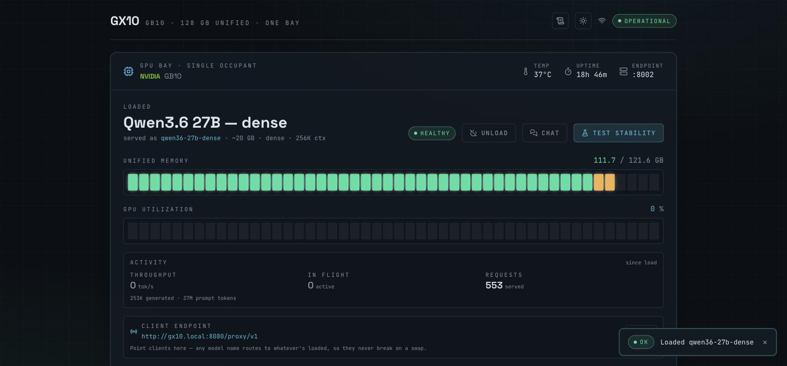
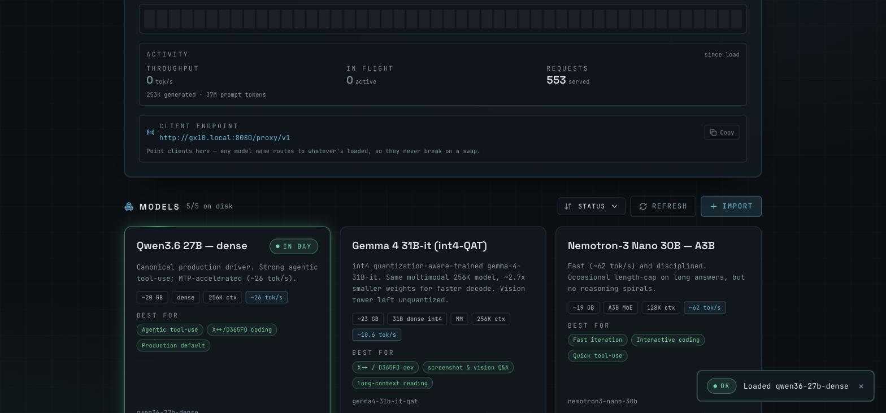
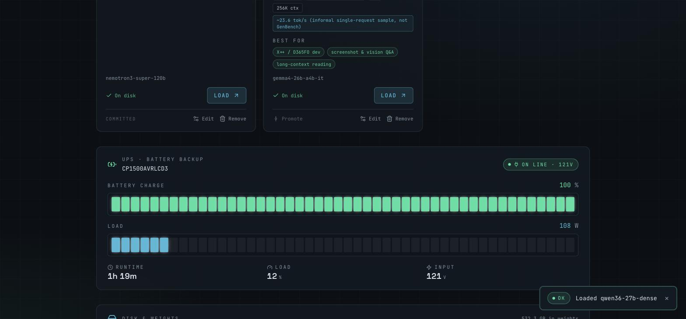
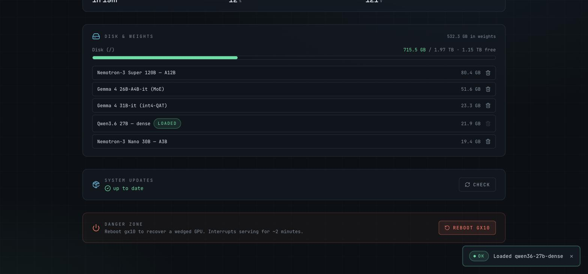
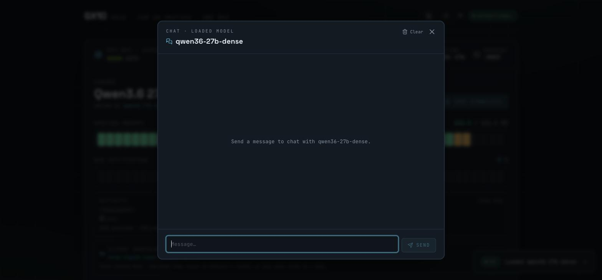

# gb10 Model Swapper

A small web control plane, **hosted on the box itself**, for one-model-at-a-time vLLM serving on
an NVIDIA DGX Spark (GB10, 128 GB unified memory). The GB10 has no MIG support (architectural, per
NVIDIA — a consequence of the unified CPU/GPU memory pool), so there's no hardware-isolated way to
run several models concurrently with guaranteed separation; this tool deliberately serves one at a
time instead. This dashboard shows what's loaded and lets you click to swap: it checks the current
model, and if the target differs it stops the running container, **drains the GPU** (critical — as
the box's sole/primary GPU, `nvidia-smi -r` refuses to reset it; an un-drained swap can wedge it
into a reboot-only state), starts the target with its correct per-model recipe, and waits for
health. Every model is served on the **same
port `:8002`**, so clients never change their endpoint.

## Screenshots

| GPU bay | Models |
|---|---|
|  |  |

| UPS | Disk, updates & danger zone |
|---|---|
|  |  |



## Layout

```
swap-ui/
├── app.py              FastAPI backend (status/models/swap/reboot; serves the built SPA)
├── stability.py         the GB10 stability battery (see "Model lifecycle" below)
├── requirements.txt    fastapi + uvicorn
├── bootstrap.sh        create the .venv on the box
└── frontend/           React + Vite + Tailwind dashboard (built → dist/, served by app.py)
```

The actual swap logic lives in the sibling bash drivers (single source of truth for the validated
vLLM flags), which this backend invokes:

- `../orchestration/gb10-swap.sh` — the stop → drain → serve sequence (idempotent; emits
  `PHASE`/`RESULT` lines the backend parses).
- `../orchestration/gb10-serve.sh` / `gb10-stop.sh` / `gb10-lib.sh` — with `GB10_LOCAL=1` these run
  against **local** docker/nvidia-smi instead of over SSH.

**Model recipes live in a dedicated repo — [`007applejacks/gb10-model-configs`](https://github.com/007applejacks/gb10-model-configs).**
The box is the **system of record** for it: the swap-ui reads recipes from a clone on the box
(`models/*.env`, one `.env` per model — full serve recipe + UI metadata) and **commits + pushes**
promoted models directly from there (a write deploy key). Set `CONFIGS_REPO` to override the clone
path; it falls back to the in-tree `../models/` for Mac dev.
A recipe with uncommitted changes shows as a **draft**; committed = official.

## HTTP API

Chat is **not** served here — it's a separate call to the `gb10-agent` daemon on `:8090`
(`POST /agent/api/chat` through the tailnet mount, or `:8090/api/chat` directly). See `../agent/`.

| Route | Purpose |
|---|---|
| `GET /health` | app liveness |
| `GET /api/status` | current model (from `:8002/v1/models`), GPU telemetry, active swap job |
| `GET /api/logs` | tail the loaded model's container logs, or the swap-ui service journal |
| `GET /api/ups` | APC UPS telemetry (via apcupsd/apcaccess), if one's attached |
| `GET /api/models` | registry + `source` (committed/draft) + which have downloaded weights |
| `POST /api/models/refresh` | re-scan the HF-cache volume for downloaded weights |
| `POST /api/swap` `{model_id}` | start a swap (background job; poll status) |
| `GET /api/swap/status` | current job phase/result + log tail |
| `POST /api/swap/cancel` | abort an in-progress load (stops the target container, ends the driver) |
| `POST /api/unload` | stop the serving container, leave the GB10 free |
| `GET /api/disk` | HF-cache disk usage, per-model cache size, incomplete-download bytes |
| `POST /api/disk/delete` `{model_id}` | delete a model's downloaded weights (refuses if loaded/in-flight) |
| `POST /api/disk/clean` | remove leftover `.incomplete` blobs from aborted downloads |
| `GET /api/updates` | list upgradable apt packages (no privilege needed) |
| `POST /api/updates/refresh` `{password}` | `apt-get update` (password piped to `sudo -S`, never logged) |
| `POST /api/updates/install` `{password}` | `apt-get update && apt-get upgrade` |
| `GET /api/updates/job` | current apt job state + log tail |
| `POST /api/updates/cancel` | terminate an in-progress apt job |
| `POST /api/reboot` | `sudo reboot` — recover a wedged GPU (confirm-gated in the UI) |
| `POST /api/import/inspect` `{repo}` | fetch an HF repo's config.json → propose an editable recipe |
| `POST /api/models` `{recipe}` | write a new recipe (**draft** — uncommitted in the configs repo) |
| `GET /api/models/{id}/env` | raw `.env` |
| `POST /api/models/{id}/env` `{text}` | hand-edit a recipe's raw `.env` text in place |
| `GET /api/models/{id}/hf-lookup` | re-fetch the model's own config.json from HF (ground truth for the editor) |
| `POST /api/models/{id}/promote` | **commit + push** the recipe to the configs repo (non-experimental only) |
| `DELETE /api/models/{id}` | remove a **draft** recipe (committed ones are removed via the repo) |
| `POST /api/import/download` `{repo}` | pull weights into the HF-cache volume (background; byte progress) |
| `GET /api/import/status` | current download progress + log tail |
| `POST /api/test` | run the GB10 stability battery against the loaded model (background) |
| `GET /api/test/status` | live per-test results + report |
| `* /proxy/v1/{path}` | **transparent model proxy** (see below) |

## Transparent model proxy

Clients hardcode a served-model-name, so they **404 when a different model is loaded**. The proxy at
**`/proxy/v1`** is an OpenAI-compatible endpoint that accepts **any** model name and transparently
rewrites it to whatever is currently loaded on `:8002` (streaming supported; returns `503` when the
bay is empty). Point clients at it and they never break on a swap:

```
# instead of  http://<your-box>:8002/v1   (breaks when you swap models)
COPILOT_PROVIDER_BASE_URL=http://<your-box>:8080/proxy/v1     # any model name works
# or over your tailnet, with HTTPS:
COPILOT_PROVIDER_BASE_URL=https://<your-box>.<your-tailnet>.ts.net/proxy/v1
```

The dashboard's GPU bay shows the exact endpoint (adapting to how you reached it) with a copy button.

## Model lifecycle

**import → draft (experimental) → load → stability tests → pass clears experimental → Promote commits.**

- **Import** (button, or deep-link `/?import=<owner/repo>`) inspects an HF repo's `config.json`,
  proposes a recipe (reasoning parser by family, context from `max_position_embeddings`, quant from
  `quantization_config`), and lets you edit it. Saved recipes are **drafts** (uncommitted in the
  configs repo), pin the tuning knobs (spec-decode / KV / sampling) **off**, and are flagged experimental.
- **Test stability** (button on the loaded model) runs the **GB10 stability battery** — generic,
  model-agnostic checks, each targeting a known GB10 failure mode: endpoint health, basic generation,
  coherence, long-form (silent stall), streaming (hang), tool-calling (spec-decode drops), large-context
  (KV OOM), concurrency (wedge), sustained run (EngineDeadError). It judges *server* stability (request
  completes cleanly) with generous token budgets — empty-output rate is **reported, not gated**, since a
  reasoning model choosing to think a lot isn't instability.
- **Promote** (button on a draft, enabled once non-experimental) does `git add && commit && push` to the
  configs repo from the box — no round-trip needed.
Use **Export recipe** on a local card to get the `.env` to promote into `models/` and commit.

**HF token (optional):** authenticated / gated / full-speed pulls need `HF_TOKEN`. Put it in a
root-owned env file the service reads (referenced by the systemd unit's `EnvironmentFile=-`):

```
# /etc/gb10-swap.env   (chmod 640, root:root — never committed)
HF_TOKEN=hf_xxxxxxxx
```

Without it, public repos still download (unauthenticated → rate-limited) and gated repos fail.

## Deploy (author on your dev machine → deploy to the box)

Edit here and commit, then deploy to a clone on the box.

1. **Build the frontend** (the box needs no Node at runtime):
   ```bash
   cd swap-ui/frontend && npm ci && npm run build      # → frontend/dist/
   ```
2. **Ship it** (`dist/` is gitignored, so rsync it alongside the git pull):
   ```bash
   ssh <your-box> 'cd ~/github/dgx-spark-model-swapper && git pull'
   rsync -a swap-ui/frontend/dist/ <your-box>:github/dgx-spark-model-swapper/swap-ui/frontend/dist/
   ```
   (Or, if Node is installed on the box, build there instead of rsyncing.)
3. **Backend venv** (once):
   ```bash
   ssh <your-box> 'cd ~/github/dgx-spark-model-swapper/swap-ui && ./bootstrap.sh'
   ```
4. **Install + start the service:**
   ```bash
   scp systemd/gb10-swap.service <your-box>:/tmp/ \
     && ssh <your-box> 'sudo mv /tmp/gb10-swap.service /etc/systemd/system/ \
        && sudo systemctl daemon-reload && sudo systemctl enable --now gb10-swap'
   ```

Then open it — reachable over LAN and, optionally, your tailnet. No auth (trusted-network decision).

### Tailnet HTTPS (tailscale serve)

For a clean HTTPS URL on your tailnet (valid cert, no `:8080`), a `tailscale serve` proxy can be
enabled on the box:

```bash
sudo tailscale serve --bg 8080          # https://<your-box>.<your-tailnet>.ts.net/ -> 127.0.0.1:8080
tailscale serve status                  # inspect
sudo tailscale serve --https=443 off    # disable
```

This is **tailnet-only** (private — not `tailscale funnel`, so it is NOT exposed to the public
internet), and the `--bg` config persists across reboots (stored in tailscaled state, not a repo
file). Requires HTTPS/MagicDNS certs enabled for the tailnet (admin console). The plain `:8080`
LAN/tailnet endpoint keeps working alongside it.

### Reboot button — sudoers requirement

The Reboot button runs `sudo /sbin/reboot`. Grant the service's user (`deploy` by default — see
`systemd/gb10-swap.service`) passwordless rights for just that command. Install a sudoers drop-in
on the box:

```
# /etc/sudoers.d/gb10-swap-reboot   (chmod 440, edit via visudo -f)
deploy ALL=(root) NOPASSWD: /sbin/reboot
```

**Without it, this fails silently, not loudly**: `/api/reboot` fires `sudo /sbin/reboot` in the
background and returns `{"rebooting": true}` immediately without checking whether `sudo` actually
succeeded, and the dashboard just optimistically shows "Rebooting…" — so a missing sudoers rule
means the button appears to work but the box never actually reboots, with no error surfaced
anywhere. Set this up before you need it.

### Boot restore

`gb10-swap.sh` records the last-loaded model to `~/.config/gb10-swap/last-model`. The
`gb10-serve-boot.service` unit (in `../orchestration/`) reads it and restarts that model's container
after a reboot, so the bay comes back to whatever you last loaded.

## Notes / follow-ups

- **Recipe changes**: a model's container is created once then start/stop-ed. If you change a model's
  `*.env` recipe, remove its stale container on the box (`docker rm swap-vllm-<id>`) so the next swap
  recreates it with the new flags.
